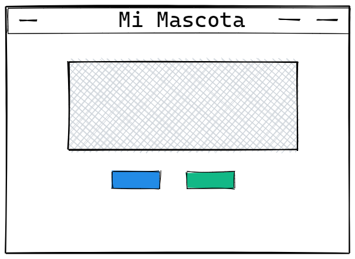
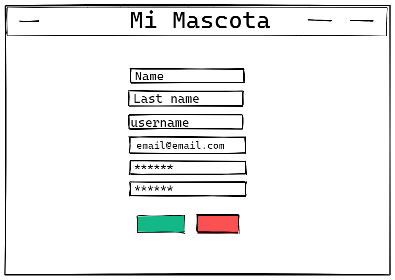
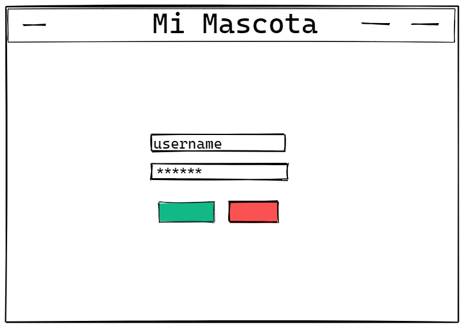
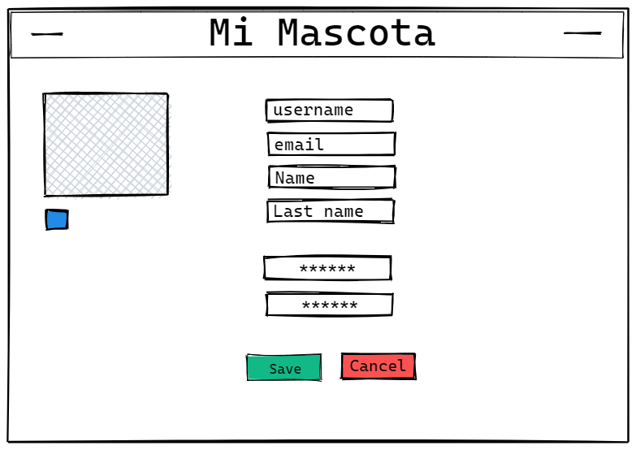
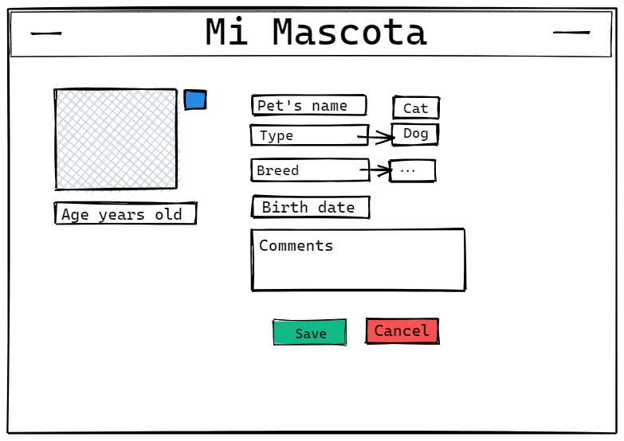
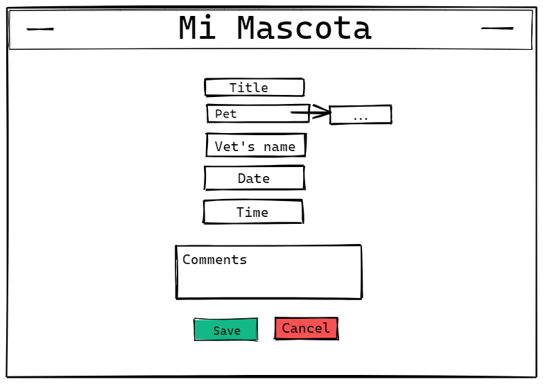

# Mi Mascota App

# Developers: 
Santi Casa - Alba Olveros

# Link to App: 
[Link]

## Description

An app where users keep track if their pet's health.
 
## User Stories

- **404** - As a user I want to see a nice 404 page when I go to a page that doesn’t exist so that I know it was my fault .
- **500** - As a user I want to see a nice error page when the super team screws it up so that I know that is not my fault.
- **Homepage** - As a user I want to be able to access the homepage so that I see what the app is about and login and signup.
- **Sign up** - As a user I want to sign up on the webpage so that I can sing up.
- **Login** - As a user I want to be able to log in on the webpage so that I can get back to my account.
- **Logout** - As a user I want to be able to log out from the webpage so that I can make sure no one will access my account.
- **User profile page** - As a user I want to see my profile page once I sign up/log in. This profile contains all the user's pets.
- **Pet create** - As a user I want I want create my pet profile from my user profile page.
- **Pet details** - As a user I want to see my pet's information: vaccines, vet's appointments, and the pet's breed.
- **Vet's appointment details** - As a user I want to be able to see the vet's location, the appointment time and date, vet's details, and a comments box.

## Backlog
- **Login Social** - Google, Twitter, etc.
- **Use Map Location** - For vet's office

## ROUTES

|Method|URL|Description|
|---|---|---|
GET | /login | redirects to / if user logged in. Renders auth/login
POST | /login | redirects to / if user logged in

```
body:
    - username
    - password
```
|Method|URL|Description|
|---|---|---|
GET | /signup | Renders auth/signup

```
body:
    - name
    - last name
    - username
    - email
    - password
```
|Method|URL|Description|
|---|---|---|
GET | /user-profile | renders user profile. If the user is not logged in, render homepage. 
GET | /edit/user-profile | renders user profile edit page. If the user is not logged in, render homepage. 
POST | /edit/user-profile | update user profile. Redirect /user-profile
POST | /logout | redirects to /
```
body:
    - pic
    - name
    - last name
    - username
    - email
    - password
    - pets
```
|Method|URL|Description|
|---|---|---|
GET | /pet-profile:Id | renders pet profile page
GET | /edit/pet-profile:Id | renders pet profile edit page
POST | /edit/pet-profile:Id | update pet profile. Redirect /pet-profile:Id
POST | /logout | redirects to /
```
body:
    - pic
    - name
    - type
    - breed
    - birth date
    - age
    - comments
```
|Method|URL|Description|
|---|---|---|
GET | /appointment:Id | renders appointment page
GET | /edit/appointment:Id | renders pet profile edit page
POST | /edit/appointment:Id | update appointment. Redirect /user-profile
GET | /create/appointment | renders appointment create page
POST | /create/appointment | saves appointment. Redirect /user-profile
POST | /logout | redirects to /
```
body:
    - title
    - pet
    - vet's name
    - date
    - time
    - comments
```

## Models

```
User model
- username: String, required
- first name: String, required
- last name: String, required
- password: String, required
- image: String
- pets: Array ObjectID
```
```
Pet model
- name: String, required
- owner: ObjectID
- type: String, required
- breed: String, required
- comments: String
- birth date: Date, required
- appointments: Array ObjectID
```
```
Appointment model
- title: String, required
- vet: String, required
- pet: ObjectID, required
- date: Date, required
- time: Date, required
- comments: String
```
## Wire Frames
Home

Signup

Login

User profile

User profile edit

Pet profile

Create/edit appointment
